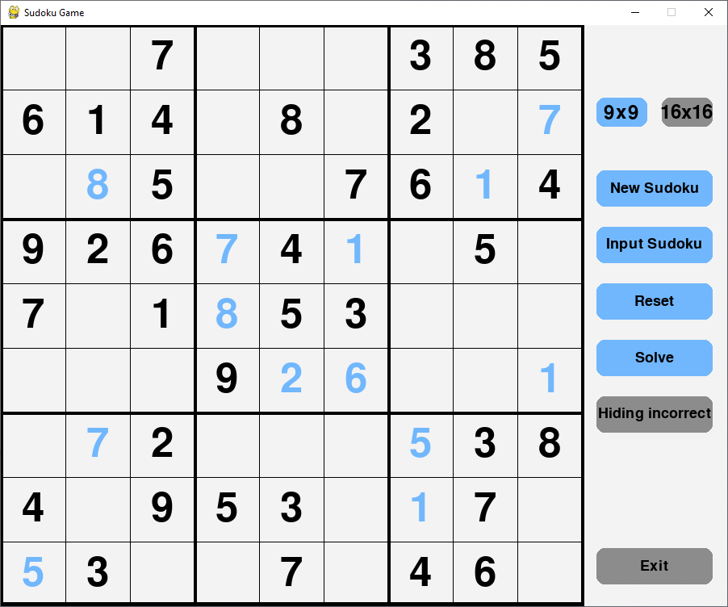

# Sudoku game and solver
Small and easy to use sudoku game and solver. Infinite number of puzzles to solve with 3 difficulties.
You can enter your on sudoku and keep solving it in the application.  

### Highlights:
* Endless random sudoku puzzles.
* Auto save and load incomplete sudoku.
* Can play and enter 9x9 and 16x16 sized sudoku.
* Toggle on/off marking mistakes.

  

### setup and run:
<details>
  <summary>Setup</summary>
  This guide is based on windows console.  
  
  set up the environment:  
  ```
  py -m venv venv
  ```
  starting the environment:  
  ```
  venv\Scripts\activate
  ```
  install the needed libraries:
  ```
  pip install .
  ```
  use pytest tests:
  ```
  pip install .[test]
  ```  
  
</details>

<details>
  <summary>Compiling to exe</summary>
  
  1. Install 'pyinstaller' using:
  ```
  pip install .[exe]
  ```
  2. Compiling:  
  ```
  pyinstaller  -F --noconsol game.py
  ```
  3. When the process is complete, the game.exe will be in the sub folder 'dist'.
  
</details>
